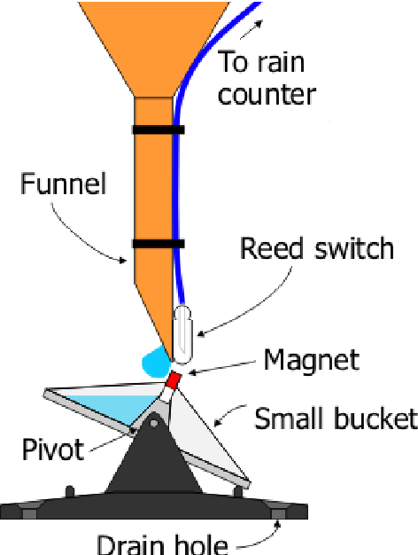

## Definición de Requisitos y Casos de Uso del Trabajo Final de Sistemas Embebidos

### Selección del proyecto a implementar

Uno de los propósitos de tomar este seminario fue el de desarrollar un sistema que tenga utilidad en la actividad empresarial en la que el alumno se desarrolla. Por ello, es que se debió elegir entre estos dos proyectos:
* Sistema de medición de nivel y llenado de tanques de agua para un campo ganadero
* Tipping Bucket Rain Gauge (Pluviómetro Digital por Balancín)

Los aspectos a analizar a la hora de elegir entre los dos proyectos son:
* Tiempo de implementación
* Aporte de nuevos  conocimientos
* Utilidad del sistema
* Disponibilidad de módulos de Hardware

En la Tabla 1 se aprecia una comparativa de los pesos de ambos proyectos. El proyecto con más peso final es el que resultará elegido como trabajo final.

Proyecto 1: `Tipping Bucket Rain Gauge`
Proyecto 2: `Sistema de medición de nivel y llenado de tanques de agua para un campo ganadero`

| Proyecto   |                   | Tiempo de Implementación(10) | Aporte de nuevos conocimientos (9) | Utilidad del Sistema (8) | Disponibilidad de módulos de hardware (5) | Peso Final |
|------------|-------------------|------------------------------|------------------------------------|--------------------------|-------------------------------------------|------------|
| Proyecto 1 | Puntaje           |8                             |10                                  |9                         |9                                          |            |
| Proyecto 1 | Puntaje Ponderado |80                            |90                                  |72                        |45                                         |287         |
| Proyecto 2 | Puntaje           |8                             |7                                   |9                         |7                                          |            |
| Proyecto 2 | Puntaje Ponderado |80                            |63                                  |72                        |35                                         |250         |

_Tabla 1: Comparación de puntajes ponderados de los proyectos candidatos para trabajo final_

Los tiempos de implementación de los proyectos son acordes a la materia, y además, ambos son extremadamente útiles una vez implementados.

A pesar de ello, no se dispone de los módulos de hardware necesarios para implementar el Sistema de Medición de nivel y llenado de tanques de agua para un campo ganadero, y además no resultaría tan enriquecedor en lo que a adquisición de nuevos conocimientos respecta.

El tipping bucket rain gauge hace uso del módulo SIM800L y de un módulo GPS. El know-how que se obtendrá será muy enriquecedor para futuros sistemas a desarrollarse en el rubro agropecuario.

Es por ello que se termina eligiendo el Tipping Bucket Rain Gauge como proyecto final. Se aclara además que el Sistema de medición de nivel y llenado de tanques de agua para un campo ganadero será implementado en el futuro (no en el marco de esta materia).

_Breve descripción del proyecto Tipping Bucket Rain Gauge_

La finalidad de este proyecto es la de disponer de un pluviómetro digital de fácil instalación en lotes agrícolas. Con ello, podemos obtener información acerca del milimetraje de agua, horas de mayor volumen de lluvia y variabilidad de precipitación en los diferentes lotes de un establecimiento.

El pluviómetro utiliza un reed-switch y un imán para detectar los movimientos de un balancín. El balancín oscila al llenarse con un volumen de agua conocido.

En la Figura 1 se observa una representación del sistema mecánico del pluviómetro digital.

_Figura 1: Tipping Bucket Rain Gauge Scheme_

Conociendo el número de oscilaciones que da el balancín para obtener un milimetraje determinado, es posible determinar, de manera indirecta, el milimetraje caído en la zona de estudio.

El sistema enviará información acerca del milimetraje caído por hora utilizando el módulo SIM800L. Además, se enviará la ubicación del pluviómetro.  La información será recibida por un servidor corriendo una aplicación python comunicada por un socket en un puerto determinado.

En la Figura 2 se observa un diagrama de bloques del sistema.

_Figura 2: Diagrama de bloques del tipping bucket rain gauge_

### Elicitación de requisitos y casos de uso

Existen varios sistemas para medir precipitaciones en el mercado. En la Tabla 2 se observa una comparación de sus características.

| Característica         | Omixom OMX-Rain                           | Daza DZH2900                              |
|------------------------|-------------------------------------------|-------------------------------------------|
| Conectividad GPRS      | Sí                                        | No                                        |
| Cargador Solar         | Sí                                        | No                                        |
| API para HTTP Requests | Sí                                        | No                                        |
| Sensores               | Pluviómetro de cubeta Basculante          | Pluviómetro + Anemómetro + Sensor de T°   |
| Alimentación           | Baterías AA                               | Sin batería (transformador a 220V)        |
| Precio                 | 875USD + IVA                              | 528USD + IVA                              |
| Posicionamiento GNSS   | No                                        | No                                        |
| SD Card                | Sí                                        | Sí                                        |

_Tabla 2: Comparación entre dos productos de medición de precipitaciones disponibles en el mercado_

El sistema de Omixom es el que más se asemeja al dispositivo que se quiere construir. La principal limitante para el establecimiento es su precio. Si se quieren instalar varios pluviómetros con fines experimentales, el precio no justificará las pruebas.

Por otro lado, la flexibilidad que da el sistema que va a desarrollarse es clave a la hora de mutar el proyecto. Si bien este prototipo al principio busca medir precipitaciones, en el futuro pueden agregarse sensores de temperatura, radiación solar, anemómetro, etc, a un costo no tan elevado. Se puede también variar la frecuencia a la que el dispositivo envía los datos al servidor (e incluso, migrar a un web server embebido).

#### Requerimientos

